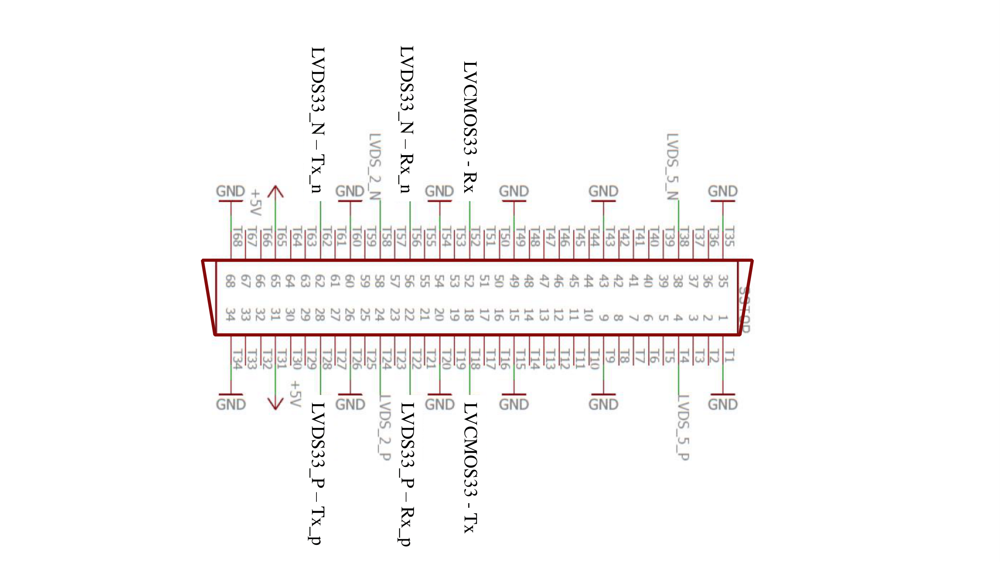

# RhythmStim-SNEO
This is a low-latency spike detector based on the Smoothed Nonlinear (or Teager) Energy Operator, for electrophysiology signals read by the [RHS Stimulation/Recording System](https://intantech.com/stim_record_controller.html) by [Intan Technologies](https://intantech.com/index.html). 
Details about technology, implementation, algorithms, and performances can be found in the accompanying paper at https://doi.org/10.3390/digital1010003. 
 

## Quick Start
Download and run the IntanStimRecordController in the [application](https://github.com/Tiax93/RhythmStim-SNEO/tree/main/RhythmStim-SNEO/application) folder if you just want to use the modified version. No need to touch anything, it includes all what you need. **Connect your headstage on port D** and enjoy a reliable spike detector on your RHS system. 
If you want to deeply adapt this design or the application for your needs, jump to the **custom installation** section for some advice. You are free to take the code in this project and adapt it to another recording system.

## What it is included
This spike detector run on the FPGA of your Intan RHS system and use the High-Speed port on the back of your system to communicate details about each detection in less than one-millisecond from the biological event. Furthermore, it provides an additional window to the Intan GUI you are used to, that gives a real-time feedback on the spiking activity that you are recording. 
From this window you can run the detector, select the threshold sensitivity and which channels to monitor. But you can set the forward of the detected events via network to any IP via UDP protocol. But you can also tune the duration of the blind windows, that avoid you to detect the stimulation artifact as events.

### Yes, but what it is included *in details*
* a 3rd order Butterworth high-pass IIR filter cutting frequencies below 300 Hz
* a Savitzky-Golay smoothing filter, fitting the high-pass filtered signal with a 2nd degree polynomial and acting as a low-pass filter (3kHz)
* a point-by-point signal energy estimation with the SNEO, that evaluates both the frequency and the amplitude of the voltage fluctuations against a threshold
* a dynamic per-channel threshold, continuously estimated from the RMS of the SNEO output, that accommodates for any drift of the probe or changes in the signal quality and rapidly converges to a firing-independent value. You can tune the sensitivity of this threshold to detect for both the Multi Unit Activity and/or the single Action Potential.
* a post-ICMS blinding window, to prevent the detection of false-events caused by the stimulation artifact.
* a USB stream to the Intan application on the host computer to show the real-time events plot and to store the file on disk
* a sub-milliseconds latency wired output giving the detections amplitude, channel, and timing details via UART
* UDP sending of events
* UDP triggering of the stimulation (settable as the old way, from the channels stimulation parameters)

## Custom Installation
If you wish to customize the design to fit for your needs:
1. download the sources from this page
1. download the original source code for the RHS Stim/Recording Controller from the [official Intan website](http://intantech.com/downloads.html?tabSelect=Source) ([C++ source code](http://intantech.com/files/RhythmStim_API_Release_180814.zip) and [FPGA Verilog HDL source code](http://intantech.com/files/RHS2000InterfaceXEM6010_release_180814.zip))
1. open the original QT project downloaded from the Intan website and import the new file contained in the qt_files folder, overwriting the existing files
1. open the original Xilinx ISE project from Intan website and import the new file contained in the xise_files folder, overwriting the existing files
1. modify whatever you needs
1. if you modified the C++ source code, recompile the qt project and use the Compile_standalone.bat in the qt_files folder to allow the application to run outside the QT editor.
1. if you modified the Verilog or VHDL code, re-generate the bitfile and copy it in the building folder of the C++ code or replace it in the application/release folder if you did not modified the C++ code

Feel free to use this code, to improve it and/or to adapt it to other devices. Just remember to cite my work :)

## Project related

### How to read the *_HW_detections.rhs files
These files contain the detected activity and can be imported in Matlab using the [read_Intan_RHS2000_events.m](https://github.com/Tiax93/RhythmStim-SNEO/blob/main/RhythmStim-SNEO/read_Intan_RHS2000_events.m) Matlab function. 
Data is imported in Matlab as a structure called "spikes" containing four array called "channel", "sample", "amplitude", and  "threshold_mult", containing respectively the channel, the timing, the amplitude of the spikes, and the threshold multiplier used of every detected spike, ordered by the time of detection.

### Communication Packet structures
#### UDP
Each packet is composed by 4 integers of 4 bytes in Big-Endian order structured as in the table.
Integer 1 | Integer 2 | Integer 3 | Integer 4
----------|-----------|-----------|----------
 0 | Timestamp | Amplitude | Channel

#### UART
Data is sent in little-endian and as in the table via UART protocol, using 8 data bits with even parity, 1 stop bit and a BAUD rate of 115200 (that can be customized in the design, spike_detector.vhd, line 203).
  2-bit  |   25-bit  |   5-bit   
---------|-----------|-----------
 ID "10" | Timestamp |  Channel  

UART communication uses the high-speed I/O port on the back of the recording unit and transmit/receive both in LVDS3.3 and LVCMOS3.3 mode, from the pins highlighted in the image below.

## Example screen
 

 

### License
This project is provided as-is under the GNU General Public License v2.0 (read LICENSE for further information), without any express or implied warranty. 
